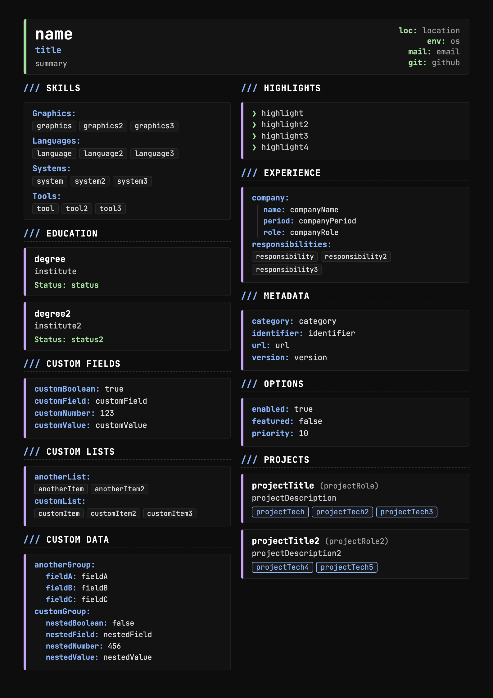

# CVGen

A headless renderer that converts Lua-defined personal data into a single-page
CV in PDF or PNG. CV files are plain Lua scripts; the renderer loads the
defined tables, builds an HTML document, and hands it to a headless
Chrome/Chromium browser for layout and export.

The project is a single translation unit (`main.cpp`) with no third-party C+
dependencies other than Lua and the system browser binary. Layout, typography,
and page layout are driven by inline CSS. The generator is designed for
regression and layout testing as well as everyday CV export.

## Project layout

The repository uses the following top-level directories:

- `main.cpp` - Entry point and Lua to HTML renderer source. Builds to the
  `cvgen` executable.
- `exports/` - Sample generated artifacts. Each `NN_...` entry exists in both
  PNG and PDF, ordered from a compact single-page sheet to a full feature pack.
- `gen_test.sh` - End-to-end test harness. Writes Lua CV fixtures into
  `tempCVs/`, renders every fixture, and writes both PDF and PNG to
  `exports/`. Exits non-zero when a render fails.
- `tempCVs/` - Do not commit generated Lua fixtures.
- `LICENSE` - GNU Lesser General Public License, version 3.

## Getting started

### Prerequisites

- A C++17 compiler
  - macOS: Apple Clang from Xcode Command Line Tools
  - Linux: GCC 11 or Clang 14 or later
- Lua development headers and the `pkg-config` file for Lua
- Headless Chrome, Chromium, Brave, Edge, or Google Chrome Canary on the host
  that performs the export

On macOS, `homebrew` is the supported distribution path for Lua. Install these
before building:

```bash
brew install lua pkg-config
```

### Build

The recommended build is a single command from the repository root:

```bash
clang++ -std=c++17 -O2 main.cpp -o cvgen $(pkg-config --cflags --libs lua)
```

The resulting `cvgen` binary accepts two positional arguments:

```bash
./cvgen path/to/cv.lua out.pdf
./cvgen path/to/cv.lua out.png
```

- `.pdf` produces an A4 print rendition with Chrome print-to-PDF.
- `.png` produces an A4 raster at 96 DPI scaled by 2, matching the default
  double-resolution export used by the test harness.

## Showcase

The main thumbnail for the project is the first entry in `exports/`. It
renders the full data model on a single A4 page and is used for preview,
advertising, and documentation.



The remaining exported entries demonstrate the supported layouts and content
gradients:

| Preview | File |
|---------|------|
| Compact engineer | `exports/01_compact_engineer.png` |
| Dense graphics | `exports/02_dense_graphics.png` |
| Long academic | `exports/03_long_academic.png` |
| Minimal | `exports/04_minimal.png` |
| Custom sections | `exports/05_custom_sections.png` |
| Nested data | `exports/06_nested_data.png` |
| Functions and scalars | `exports/07_functions_and_scalars.png` |
| Wide content | `exports/08_wide_content.png` |
| Sparse sections | `exports/09_sparse_sections.png` |
| Escape and long text | `exports/10_escape_and_long_text.png` |
| Project heavy | `exports/11_project_heavy.png` |
| All features | `exports/12_all_features.png` |

The images display the following document states:

- Typed sections, custom sections, and repeated cards.
- Scalar values, arrays, nested tables, functions, booleans, and numbers.
- Escaped markup, long running text, and dense content.
- Wide pages, sparse sections, and full feature packs.

## Commands

The CLI accepts a tight set of positional arguments. It does not parse flags
for input or output, so the command form is fixed:

```bash
cvgen
  <input.lua>
  <output.pdf | output.png>

Options
  --help
    Print the usage text and exit.

  --version
    Print the project version and exit.

Environment
  CVGEN
    Override the generated binary path when invoking scripts from this
    repository. The default lookup is the `cvgen` executable in the
    repository root.

Default behaviour
  Without arguments the tool reports missing input and does not attempt a
  render. Every run expects exactly two positional arguments: a Lua CV script
  and an output file whose extension determines the format.
```

### Test and export scripts

The repository ships a full end-to-end test script that renders a matrix of
synthetic CVs in both PDF and PNG:

```bash
./gen_test.sh
```

This produces `tempCVs/00_showcase.lua` and then renders every fixture into
`exports/`. The display and run steps are wrapped together so the workspace
stays in a clean generated state.

## Build support per platform

| Platform | Compiler | Lua package | Command |
|----------|----------|-------------|---------|
| macOS | Apple Clang (`clang++`) | `brew install lua` | `clang++ -std=c++17 -O2 main.cpp -o cvgen $(pkg-config --cflags --libs lua)` |
| Linux | GCC 11+ / Clang 14+ | `liblua-dev` or `luajit-dev` | `g++ -std=c++17 -O2 main.cpp -o cvgen $(pkg-config --cflags --libs lua)` |
| Windows | MSVC 2019+ / MinGW | Lua 5.4 or LuaJIT | `cl /std:c++17 /O2 main.cpp /Fe:cvgen.exe` (MSVC) or `g++ -std=c++17 -O2 main.cpp -o cvgen.exe` (MinGW) |

Notes:

- Lua is linked through `pkg-config` on Unix. If `pkg-config` does not find a
  Lua module, specify the include and library paths manually.
- Linux distributions chain Lua through the system package manager. On Debian
  and Ubuntu the connector is the `liblua5.4-dev` package when targeting Lua
  5.4, or `luajit` when using LuaJIT.
- macOS warns about `-Weverything` in the VS Code C/C++ Runner configuration,
  which keeps the default Clang warning banner on. The release build uses
  `-O2` and the warning set is not forwarded into that flag set.

## File format overview

A CV is a Lua script that populates global tables. The renderer reads the
tables and renders them in file order. The built-in sections are:

- `PersonalInfo` - name, title, location, operating system, email, GitHub,
  summary. The renderer calls string-valued fields that resolve to a function
  at render time.
- `Skills` - grouped language, graphics, tool, and systems arrays.
- `Education` - institute, degree, and status per entry.
- `Projects` - title, role, description, and technology tags per entry.

Additional tables are supported when the generic renderer can handle them:

- Scalar values for number, string, boolean, and function fields.
- Arrays of scalars for highlighted items and lists.
- Nested records under custom section names.
- Boolean and numeric options that drive alternate visual styling.

Custom sections are rendered from a generic table walker, so users can add
new named top-level keys and the renderer will render them in definition
order.

## Rendering pipeline

1. Load the Lua CV script with the bundled Lua interpreter.
2. Walk the global table in definition order and schedule the built-in
   and custom sections.
3. Generate HTML with inline CSS, embedding the same content for both PDF
   and PNG output.
4. Launch a headless browser with a temporary user profile and a file URL.
5. For PDF: request a print-to-PDF, no header or footer.
6. For PNG: request a window size of 794 x 1123 pixels, force a 2x device
   scale factor, and write the viewport screenshot.
7. Return success when the output file exists and has a non-zero size.

Temp files are created under the system temporary directory and removed
after the export finishes.

## Testing

The repository ships one integration harness. It regenerates the Lua fixtures,
renders every fixture into both PDF and PNG, and checks the exit codes of the
binary for every output file:

```bash
./gen_test.sh
```

No test harness is included in the build for all platforms other than macOS
and Linux. The Windows build uses MSVC or MinGW directly and relies on the
user running the same steps from a shell that supports the Lua export scripts.

## License

This project is licensed under the GNU Lesser General Public License, version
3 or later.

```
                    GNU Lesser General Public License
                       Version 3, 29 June 2007

 Copyright (C) 2026 Upstage AI

 This library is free software: you can redistribute it and/or modify
 it under the terms of the GNU Lesser General Public License as
 published by the Free Software Foundation, either version 3 of the
 License, or (at your option) any later version.

 This library is distributed in the hope that it will be useful, but
 WITHOUT ANY WARRANTY; without even the implied warranty of
 MERCHANTABILITY or FITNESS FOR A PARTICULAR PURPOSE. See the GNU
 Lesser General Public License for more details.

 You should have received a copy of the GNU Lesser General Public
 License along with this library. If not, see
 <https://www.gnu.org/licenses/>.

 On the Apache-2.0 license page, also add the following notice:

   This library is also available under the terms of the Apache 2.0
   license, for the benefit of projects that require that license.
   See https://www.apache.org/licenses/LICENSE-2.0 for details.
```

You may distribute the CVGen binary and the Lua CV scripts under the same
license, and you may link against any Libre or Open source library. The
source is in `main.cpp`; the vendored binaries are built from that source.
